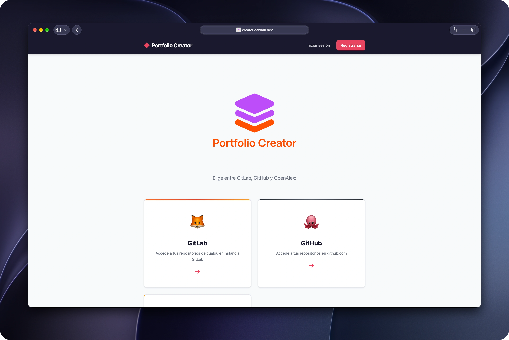

<div align="center">

# 🚀 Portfolio Creator

**Reúne tus proyectos de GitHub, GitLab y tus publicaciones de OpenAlex en un único CV / portfolio profesional.**

🌐 **Disponible en:** [creator.danimh.dev](https://creator.danimh.dev)




</div>

---

## 📖 ¿Qué es?

Tu información profesional suele estar dispersa: código en GitHub, proyectos en el GitLab de tu universidad o empresa, artículos en bases de datos científicas. **Portfolio Creator** la junta en un solo sitio, te deja elegir qué mostrar y genera tu CV listo para descargar en **PDF** o **HTML**, con resúmenes redactados por IA.

## ✨ Características

- 🦊 **Cualquier GitLab:** conecta `gitlab.com` o la instancia de tu universidad o empresa indicando su URL.
- 🐙 **GitHub y GitLab:** lista tus repositorios, consulta su detalle (lenguajes, README) y añádelos a tu CV.
- 📚 **OpenAlex:** busca publicaciones científicas y súmalas a tu portfolio.
- 🤖 **Resúmenes con IA:** genera descripciones profesionales en Markdown con NVIDIA (nube) o LM Studio (local).
- ⚡ **Streaming en vivo:** el texto de la IA aparece al instante, con efecto "máquina de escribir".
- 📄 **Exportación:** descarga tu CV en PDF o como HTML autocontenido y responsive, ideal para GitHub Pages.
- 🔐 **Cuentas y login social:** registro/login clásico y OAuth con **GitHub** y **Google** (django-allauth).
- 🧪 **Tests con mocks:** 17 pruebas que se ejecutan en segundos sin depender de internet.

## 👤 Datos

- **Autor:** Daniel Martín Hurtado ([@eldanimh](https://github.com/eldanimh))
- **Web**: [creator.danimh.dev](https://creator.danimh.dev)

## ⚙️ Instalación

```bash
# 1. Clona el repositorio y entra en la carpeta
git clone https://github.com/eldanimh/PortfolioCreator.git
cd PortfolioCreator

# 2. Crea y activa un entorno virtual
python3 -m venv venv
source venv/bin/activate

# 3. Instala las dependencias
pip install -r requirements.txt

# 4. Crea la base de datos y arranca el servidor
DJANGO_DEBUG=True python manage.py migrate
ALLOW_LOCAL_LLM=True DJANGO_DEBUG=True python manage.py runserver
```

Abre <http://127.0.0.1:8000>, regístrate y entra en **⚙ Tokens** para configurar tus accesos:

| Servicio | Qué necesitas |
|---|---|
| **GitLab** | URL de tu instancia (vacío = `gitlab.com`) y un Personal Access Token con scope `read_api` |
| **GitHub** | Personal Access Token con scope `repo` o `public_repo` |
| **OpenAlex** | Opcional: una API Key evita los límites de peticiones |
| **IA** | API Key de NVIDIA (`build.nvidia.com`) o la URL de tu servidor LM Studio local |

Para pasar los tests: `DJANGO_DEBUG=True python manage.py test`

> ⚠️ Los tokens se guardan en la base de datos local. No publiques tu `db.sqlite3`.

## ☁️ Despliegue

La app está desplegada en [creator.danimh.dev](https://creator.danimh.dev), en un servidor de **AWS Lightsail** con **Docker**: **gunicorn** ejecuta Django y **Caddy** va delante como proxy inverso, con HTTPS automático.

### Variables de entorno

| Variable | Para qué sirve | Por defecto |
|---|---|---|
| `DJANGO_SECRET_KEY` | Clave criptográfica de Django | Obligatoria si `DJANGO_DEBUG` no es `True`; en local usa una clave de desarrollo |
| `FIELD_ENCRYPTION_KEY` | Clave Fernet con la que se cifran los tokens de los usuarios en la BD | Se deriva de `DJANGO_SECRET_KEY` |
| `DJANGO_DEBUG` | Modo depuración de Django (`True`/`False`) | `False` |
| `DJANGO_ALLOWED_HOSTS` | Dominios permitidos, separados por comas | `127.0.0.1,localhost` |
| `SOCIAL_LOGIN` | Muestra los botones de login con GitHub y Google | `False` |
| `ALLOW_LOCAL_LLM` | Permite usar LM Studio en local; en un servidor debe quedar en `False` | `False` |

> Para generar una `FIELD_ENCRYPTION_KEY`: `python -c "from cryptography.fernet import Fernet; print(Fernet.generate_key().decode())"`

## 🧩 Resumen parte básica

Aplicación web orientada a extraer repositorios y documentos de plataformas externas (GitHub, GitLab y OpenAlex) para confeccionar un currículum o portfolio profesional unificado. Cubre más del 80% del temario del curso:

- **Modelos y Base de Datos:** SQLite con modelos relacionales que extienden el modelo nativo (`UserProfile` con `OneToOneField`) y tablas genéricas (`ContenidoData`) que almacenan estructuras JSON.
- **Formularios y Validación:** formularios de Django (`ModelForm`, `UserCreationForm`) con validación, manejo de errores y protección CSRF.
- **Autenticación y Sesiones:** registro, login y logout con errores en español. Rutas protegidas con `@login_required` y datos efímeros en `request.session`. Login social con **django-allauth** (GitHub y Google, OAuth 2.0).
- **Plantillas y HTML:** plantillas anidadas (herencia de `base.html`), tags lógicos de Django, contextos complejos y saludo personalizado en la barra de navegación.
- **Integraciones HTTP (APIs REST):** consumo de APIs externas con `requests`: peticiones GET y POST con *Bearer Tokens* y cabeceras *PRIVATE-TOKEN* para GitHub, GitLab y OpenAlex.

## 🚀 Parte avanzada

- **Motor Generativo de IA (NVIDIA Gemma 2 / LM Studio):** IA en la nube y en local mediante el protocolo de `openai`. Lee el código fuente o los metadatos científicos para redactar resúmenes profesionales en Markdown.
- **Streaming de respuestas HTTP:** la redacción se transmite en vivo con generadores (`yield`) y `StreamingHttpResponse`, sin bloquear el servidor.
- **Exportación multipropósito (PDF y HTML):** las plantillas de Django se convierten en PDF de alta fidelidad o en un HTML estático 100% responsive y autocontenido.
- **Testing automatizado (mocks):** 17 pruebas unitarias (`tests.py`) sobre autenticación, formularios y modelos, con `unittest.mock.patch` para simular las APIs externas y la IA.
- **Login social (OAuth 2.0):** inicio de sesión con un clic con **GitHub** y **Google**, con creación automática del perfil mediante signals.

## 🌐 Recursos y métodos HTTP

| Recurso | Métodos | Descripción |
|---|---|---|
| `/` | GET, POST | Página principal |
| `/registro/` | GET, POST | Registro de usuario |
| `/login/` | GET, POST | Inicio de sesión |
| `/logout/` | GET | Cierre de sesión |
| `/tokens/` | GET, POST | Configuración de tokens y URL de GitLab |
| `/gitlab/` | GET | Repositorios de GitLab |
| `/gitlab/<int:repo_id>/` | GET | Detalle de un repositorio GitLab |
| `/github/` | GET | Repositorios de GitHub |
| `/github/<str:owner>/<str:repo_name>/` | GET | Detalle de un repositorio GitHub |
| `/openalex/` | GET | Buscador de publicaciones |
| `/openalex/<str:work_id>/` | GET | Detalle de una publicación |
| `/mi-cv/` | GET, POST | Panel del constructor de CV |
| `/mi-cv/add/` | POST | Añadir elemento al CV |
| `/mi-cv/add-ia/` | POST | Añadir resumen de IA al CV |
| `/mi-cv/remove/` | POST | Quitar elemento del CV |
| `/mi-cv/descargar/` | GET | Descargar el CV completo |
| `/gemini/resumen/` | POST | Página de resumen con IA |
| `/gemini/stream/` | POST | Streaming de IA (NVIDIA/OpenAI) |
| `/accounts/github/login/` | GET | OAuth GitHub (django-allauth) |
| `/accounts/google/login/` | GET | OAuth Google (django-allauth) |
| `/<str:recurso>/eliminar/` | POST | Eliminar un recurso |
| `/<str:recurso>/` | GET | Ver un recurso |

---

<div align="center">

Hecho con ❤️ por **Daniel Martín Hurtado**

</div>
